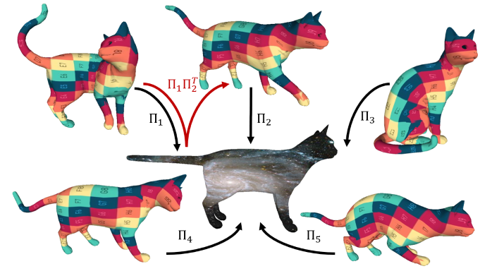

# Unsupervised Deep Multi-Shape Matching (ECCV 2022)
First method for unsupervised multi-shape matching with theoretical cycle-consistency guarantee. 



## Installation
```bash 
conda create -n fmnet python=3.8 # create new viertual environment
conda activate fmnet
conda install pytorch cudatoolkit=11.3 -c pytorch # install pytorch
conda install pyg -c pyg -c conda-forge # install torch_geometric
pip install -r requirements.txt # install other necessary libraries via pip
```

## Data preparation
Currently, the repository supports training and testing on FAUST remesh and SCAPE remesh dataset. 
The triangle mesh data and the ground truth correspondence can be downloaded through this [link](https://nuage.lix.polytechnique.fr/index.php/s/LJFXrsTG22wYCXx).
To compute SHOT descriptor as network input, we use [pyshot](https://github.com/uhlmanngroup/pyshot).
For data preprocessing, we provide *[preprocess.py](preprocess.py)* to compute all things we need (LB eigenfunctions, shot descriptor, geodesic matrix).
Here is an example for FAUST remesh data. The provided data should have a subfolder **off** containing all triangle mesh files.
```python
python preprocess.py --data_root ../data/FAUST_r/
```
The data preprocessing to train deep shell, please refer to the original implementation in [here](https://github.com/marvin-eisenberger/deep-shells).

After preprocessing, the data looks like this.
```Shell
├── data
    ├── FAUST_r
        ├── off # .off contains triangle mesh files
        ├── spectral # .mat contains Laplace-Beltrami eigenfunctions
        ├── shot # .mat contains SHOT feature descriptor
        ├── corrs # .vts contains ground truth point to point correspondences
        ├── diffusion # .mat contains spectral operators needed for DiffusionNet
        ├── dist # .mat contains geodesic distance matrices for evaluation
```
Because the SHOT descriptor computation depends on [pyshot](https://github.com/uhlmanngroup/pyshot),
please refer [pyshot](https://github.com/uhlmanngroup/pyshot) repository to install it.

The pre-computed SHOT descriptors for FAUST and SCAPE datasets in this paper can be found in the following links:

[FAUST_r](https://drive.google.com/file/d/1JOHr7LGo4GjSlyHf05tuPCvlSG2ogp83/view?usp=sharing)

[SCAPE_r](https://drive.google.com/file/d/1YEukj9KAdOBKS5hJs8ZnZDoGcPnfruvC/view?usp=sharing)


## Train
To train a model for 3D shape matching. You only need to write or use a YAML config file. 
In the YAML config file, you can specify everything around training. 
Here is an example to train.
```python
python train.py --opt options/train.yaml 
```
You can visualize the training process via TensorBoard.
```bash
tensorboard --logdir experiments/
```

## Test
After finishing training. You can evaluate the model performance using a YAML config file similar to training.
Here is an example to evaluate.
```python
python test.py --opt options/test.yaml 
```

## Pretrained models
You can find the pre-trained models on FAUST and SCAPE datasets in [checkpoints](checkpoints) for reproducibility.

## Acknowledgement
The implementation of DiffusionNet is modified from [the official implementation](https://github.com/nmwsharp/diffusion-net), 
the computation of the FM unsupervised loss and FM solvers are modified from [SURFMNet-pytorch](https://github.com/pvnieo/SURFMNet-pytorch)
and [DPFM](https://github.com/pvnieo/DPFM), the Sinkhorn normalization is adapted from [tensorflow implementation](https://github.com/google/gumbel_sinkhorn).  
We thank the authors for making their codes publicly available.

## Citation
If you find the code is useful, please cite the following paper
```bibtex
@inproceedings{cao2022,
title = {Unsupervised Deep Multi-Shape Matching},
author = {D. Cao and F. Bernard},
year  = {2022},
booktitle = {European Conference on Computer Vision (ECCV)}
}
```
